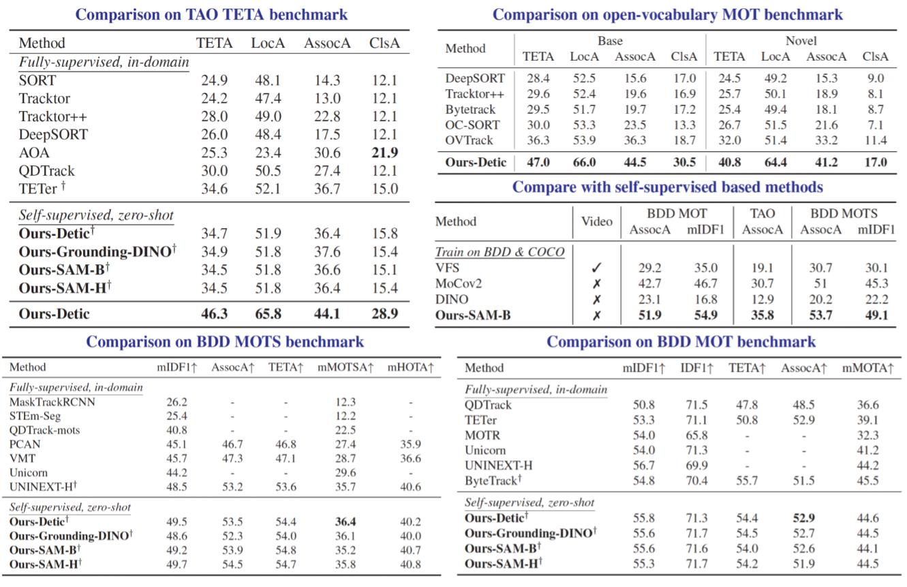

<p align="center">
    
</p>

# Matching Anything By Segmenting Anything [CVPR24 Highlight]


[ [Project Page](https://matchinganything.github.io/) ]
[ [ArXiv]() ]

[Computer Vision Lab, ETH Zurich](https://vision.ee.ethz.ch/)


<p align="center">
    
</p>


### News and Updates
- 2024.06: code will be released within June 2024 (stay tuned!).
- 2024.04: MASA is awarded CVPR highlight!

### Overview

This is a repository for MASA, a universal instance appearance model for matching any object in any domain. MASA can be added atop of any detection and segmentation models to help them track any objects they have detected.

<p align="center">
    
</p>

### Introduction
The robust association of the same objects across video frames in complex scenes is crucial for many applications, especially Multiple Object Tracking (MOT). Current methods predominantly rely on labeled domain-specific video datasets, which limits the cross-domain generalization of learned similarity embeddings.
We propose MASA, a novel method for robust instance association learning, capable of matching any objects within videos across diverse domains without tracking labels. Leveraging the rich object segmentation from the Segment Anything Model (SAM), MASA learns instance-level correspondence through exhaustive data transformations. We treat the SAM outputs as dense object region proposals and learn to match those regions from a vast image collection.
We further design a universal MASA adapter which can work in tandem with foundational segmentation or detection models and enable them to track any detected objects. Those combinations present strong zero-shot tracking ability in complex domains.
Extensive tests on multiple challenging MOT and MOTS benchmarks indicate that the proposed method, using only unlabeled static images, achieves even better performance than state-of-the-art methods trained with fully annotated in-domain video sequences, in zero-shot association.

### Benchmark Results
<p align="center">
    
</p>

### More results

> See more results on our [project page](https://matchinganything.github.io/)! 

## Contact
For questions, please contact the [Siyuan Li](https://siyuanliii.github.io/).

### Official Citation 

```bibtex
@article{masa,
  author    = {Li, Siyuan and Ke, Lei and Danelljan, Martin and Piccinelli, Luigi and Segu, Mattia and Van Gool, Luc and Yu, Fisher},
  title     = {Matching Anything By Segmenting Anything},
  journal   = {CVPR},
  year      = {2024},
}
```

### Acknowledgments

The authors would like to thank: [Bin Yan](https://masterbin-iiau.github.io/) for helping and discussion;
Our code is built on [mmdetection](https://github.com/open-mmlab/mmdetection), [OVTrack](https://github.com/SysCV/ovtrack), [TETA](https://github.com/SysCV/tet), [yolo-world](https://github.com/AILab-CVC/YOLO-World). If you find our work useful, consider checking out their work.
