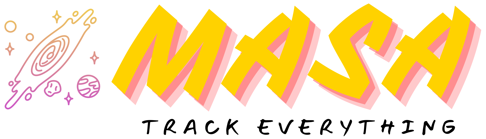
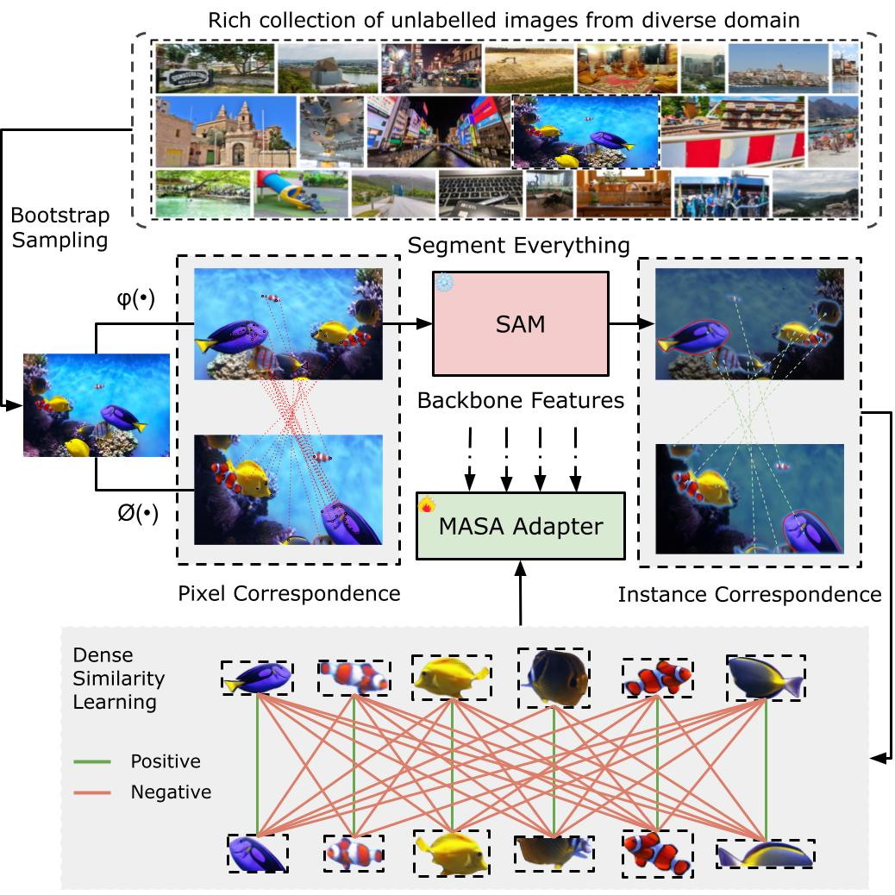
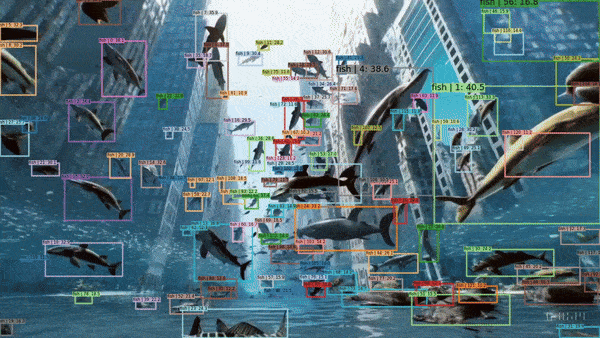
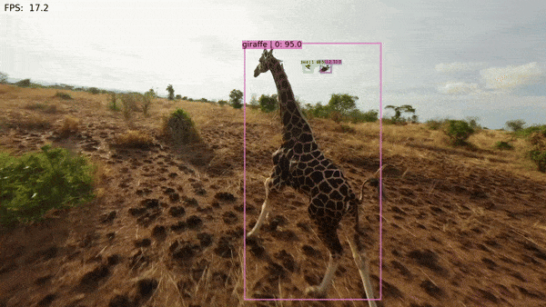
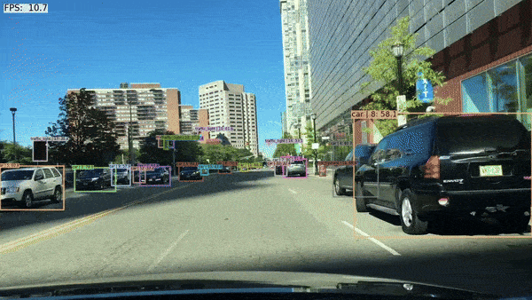

<p align="center">
    
</p>

# Matching Anything By Segmenting Anything [CVPR24 Highlight]


[ [Project Page](https://matchinganything.github.io/) ]
[ [ArXiv](https://arxiv.org/abs/2406.04221) ]

[Computer Vision Lab, ETH Zurich](https://vision.ee.ethz.ch/)


<p align="center">
    
</p>

## News and Updates
- 2024.06: MASA code is released!
- 2024.04: MASA is awarded CVPR highlight!

## Overview

This is a repository for MASA, a universal instance appearance model for matching any object in any domain. MASA can be added atop of any detection and segmentation models to help them track any objects they have detected.

<p align="center">
    
</p>


## Introduction
The robust association of the same objects across video frames in complex scenes is crucial for many applications, especially Multiple Object Tracking (MOT). Current methods predominantly rely on labeled domain-specific video datasets, which limits the cross-domain generalization of learned similarity embeddings.
We propose MASA, a novel method for robust instance association learning, capable of matching any objects within videos across diverse domains without tracking labels. Leveraging the rich object segmentation from the Segment Anything Model (SAM), MASA learns instance-level correspondence through exhaustive data transformations. We treat the SAM outputs as dense object region proposals and learn to match those regions from a vast image collection.
We further design a universal MASA adapter which can work in tandem with foundational segmentation or detection models and enable them to track any detected objects. Those combinations present strong zero-shot tracking ability in complex domains.
Extensive tests on multiple challenging MOT and MOTS benchmarks indicate that the proposed method, using only unlabeled static images, achieves even better performance than state-of-the-art methods trained with fully annotated in-domain video sequences, in zero-shot association.


## Results on Open-vocabulary MOT Benchmark

<table>
  <thead>
    <tr>
      <th rowspan="2">Method</th>
      <th colspan="2">Base</th>
      <th colspan="2">Novel</th>
      <th rowspan="2">model</th>
    </tr>
    <tr>
      <th>TETA</th>
      <th>AssocA</th>
      <th>TETA</th>
      <th>AssocA</th>
    </tr>
  </thead>
  <tbody>
    <tr>
      <td><a href="https://github.com/SysCV/ovtrack">OVTrack (CVPR23)</a></td>
      <td>35.5</td>
      <td>36.9</td>
      <td>27.8</td>
      <td>33.6</td>
      <td>-</td>
    </tr>
    <tr>
      <td>MASA-R50 🔥</td>
      <td>46.5</td>
      <td>43.0</td>
      <td>41.1</td>
      <td>42.7</td>
      <td><a href="https://huggingface.co/dereksiyuanli/masa/resolve/main/masa_r50.pth">HF🤗</a></td>
    </tr>
    <tr>
      <td>MASA-Sam-vitB</td>
      <td>47.2</td>
      <td>44.5</td>
      <td>41.4</td>
      <td>42.3</td>
      <td><a href="https://huggingface.co/dereksiyuanli/masa/resolve/main/sam_vitb_masa.pth">HF🤗</a></td>
    </tr>
    <tr>
      <td>MASA-Sam-vitH</td>
      <td>47.5</td>
      <td>45.1</td>
      <td>40.5</td>
      <td>40.5</td>
      <td><a href="https://huggingface.co/dereksiyuanli/masa/resolve/main/sam_vith_masa.pth">HF🤗</a></td>
    </tr>
    <tr>
      <td>MASA-Detic</td>
      <td>47.7</td>
      <td>44.1</td>
      <td>41.5</td>
      <td>41.6</td>
      <td><a href="https://huggingface.co/dereksiyuanli/masa/resolve/main/detic_masa.pth">HF🤗</a></td>
    </tr>
    <tr>
      <td>MASA-GroundingDINO 🔥 </td>
      <td>47.3</td>
      <td>44.7</td>
      <td>41.9</td>
      <td>44.0</td>
      <td><a href="https://huggingface.co/dereksiyuanli/masa/resolve/main/gdino_masa.pth">HF🤗</a></td>
    </tr>
  </tbody>
</table>

* We use the [Detic-SwinB](https://github.com/open-mmlab/mmdetection/blob/main/projects/Detic_new/configs/detic_centernet2_swin-b_fpn_4x_lvis-base_in21k-lvis.py) as the open-vocabulary detector to provide detections for all our variants. 
* MASA-R50: MASA with ResNet-50 backbone. It is a fast and independent model that do not use the backbone features from other detection or segmentation foundation models. It needs to be used with any other detectors. It is trained in the same way as other masa variants.

## Model Zoo
Check out our [model zoo](docs/model_zoo.md) for more detailed benchmark performance for different models.

## Benchmark Testing
If you want to test our tracker on standard benchmarks, please refer to the [benchmark_test.md](docs/benchmark_test.md).

## More results

> See more results on our [project page](https://matchinganything.github.io/)! 

## Installation
Please refer to [INSTALL.md](docs/install.md)

## Demo Run

### Preparation
1. First, create a folder named `saved_models` in the root directory of the project. Then, download the following models and put them in the `saved_models` folder.

    a). Download the [MASA-GroundingDINO](https://huggingface.co/dereksiyuanli/masa/resolve/main/gdino_masa.pth) and put it in `saved_models/masa_models/gdino_masa.pth` folder.

2. (Optional) Second, download the demo videos and put them in the `demo` folder. 
    We provide two short videos for testing (minions_rush_out.mp4 and giraffe_short.mp4). You can download more demo videos [here](https://drive.google.com/drive/folders/1o3cg_GzGHEoLnBaoqBPvL82yTsVWnXdy?usp=sharing).

3. Finally, create the `demo_outputs` folder in the root directory of the project to save the output videos.

### Demo 1:
<p align="center">
    
</p>

```bash
python demo/video_demo_with_text.py demo/minions_rush_out.mp4 --out demo_outputs/minions_rush_out_outputs.mp4 --masa_config configs/masa-gdino/masa_gdino_swinb_inference.py --masa_checkpoint saved_models/masa_models/gdino_masa.pth --texts "yellow_minions" --score-thr 0.2 --unified --show_fps
```
* `--texts`: the object class you want to track. If there are multiple classes, separate them like this: `"giraffe . lion . zebra"`. Please note that texts option is currently only available for the open-vocabulary detectors.
* `--out`: the output video path.
* `--score-thr`: the threshold for the visualize object confidence.
* `--detector_type`: the detector type. We support `mmdet` and `yolo-world` (soon).
* `--unified`: whether to use the unified model.
* `--no-post`: not to use the postprocessing. Default is to use, adding this will disable it. The postprocessing uses masa tracking to reduce the jittering effect caused by the detector.
* `--show_fps`: whether to show the fps.
* `--sam_mask`: whether to visualize the mask results generated by SAM.
* `--fp16`: whether to use fp16 mode.

The hyperparameters of the tracker can be found in corresponding config files such as `configs/masa-gdino/masa_gdino_swinb_inference.py`. Current ones are set for the best performance on the demo video. You can adjust them according to your own video and needs.

### Demo 2:
<p align="center">
    
</p>

Download the [sora_fish_10s.mp4](https://drive.google.com/file/d/1C9fZAzWh3ODMtLZbmayyBQFsDIomQA4e/view?usp=sharing) and put it in the `demo` folder.

```bash
python demo/video_demo_with_text.py demo/sora_fish_10s.mp4 --out demo_outputs/msora_fish_10s_outputs.mp4 --masa_config configs/masa-gdino/masa_gdino_swinb_inference.py --masa_checkpoint saved_models/masa_models/gdino_masa.pth --texts "fish"  --score-thr 0.1 --unified --show_fps
```

### Demo 3 (with Mask):
<p align="center">
    
</p>

a). Download [SAM-H weights](https://dl.fbaipublicfiles.com/segment_anything/sam_vit_h_4b8939.pth) and put it in `saved_models/pretrain_weights/sam_vit_h_4b8939.pth` folder.


b). Download the [carton_kangaroo_dance.mp4](https://drive.google.com/file/d/1654hyPA7fXGps6RS36FJ_6JAxZh4z6_6/view?usp=sharing) and put it in the `demo` folder.

```bash
python demo/video_demo_with_text.py demo/carton_kangaroo_dance.mp4 --out demo_outputs/carton_kangaroo_dance_outputs.mp4 --masa_config configs/masa-gdino/masa_gdino_swinb_inference.py --masa_checkpoint saved_models/masa_models/gdino_masa.pth --texts "kangaroo" --score-thr 0.4 --unified --show_fps --sam_mask
```


## Plug-and-Play MASA Tracker
You can directly use any detector along with our different MASA variants to track any object. 

### Demo with YOLOX detector:
Here is an example of how to use the MASA adapter with the YoloX detector pretrained on COCO.

Download the YoloX COCO detector weights from [here](https://download.openmmlab.com/mmdetection/v2.0/yolox/yolox_x_8x8_300e_coco/yolox_x_8x8_300e_coco_20211126_140254-1ef88d67.pth) and put it in the `saved_models/pretrain_weights/yolox_x_8x8_300e_coco_20211126_140254-1ef88d67.pth`.

Download the [MASA-R50](https://huggingface.co/dereksiyuanli/masa/resolve/main/masa_r50.pth) or [MASA-GroundingDINO](https://huggingface.co/dereksiyuanli/masa/resolve/main/gdino_masa.pth) weights and put it in the `saved_models/masa_models/`.
#### Demo 1:
<p align="center">
    
</p>
Run the demo with the following command (change the config and checkpoint path accordingly if you use different detectors or masa models):

```bash
python demo/video_demo_with_text.py demo/giraffe_short.mp4 --out demo_outputs/giraffe_short_outputs.mp4 --det_config projects/mmdet_configs/yolox/yolox_x_8xb8-300e_coco.py --det_checkpoint saved_models/pretrain_weights/yolox_x_8x8_300e_coco_20211126_140254-1ef88d67.pth --masa_config configs/masa-one/masa_r50_plug_and_play.py --masa_checkpoint saved_models/masa_models/masa_r50.pth --score-thr 0.3 --show_fps
```

### Demo with CO-DETR detector:

Here are examples of how to use the MASA adapter with the CO-DETR detector pretrained on COCO.

Download the [CO-DETR-R50](https://arxiv.org/abs/2211.12860) COCO detector weights from [here](https://download.openmmlab.com/mmdetection/v3.0/codetr/co_dino_5scale_lsj_r50_3x_coco-fe5a6829.pth) and put it in the `saved_models/pretrain_weights/co_dino_5scale_lsj_r50_3x_coco-fe5a6829.pth`.


#### Demo 1:
<p align="center">
    
</p>

Download the [driving_10s.mp4](https://drive.google.com/file/d/1fXLR4QJ0Y-LBxo43C_2VqxIRP29gm8XV/view?usp=sharing) and put it in the `demo` folder.

```bash
python demo/video_demo_with_text.py demo/driving_10s.mp4 --out demo_outputs/driving_10s_outputs.mp4 --det_config projects/CO-DETR/configs/codino/co_dino_5scale_r50_lsj_8xb2_3x_coco.py --det_checkpoint saved_models/pretrain_weights/co_dino_5scale_lsj_r50_3x_coco-fe5a6829.pth --masa_config configs/masa-one/masa_r50_plug_and_play.py --masa_checkpoint saved_models/masa_models/masa_r50.pth --score-thr 0.3 --show_fps
```

#### Demo 2:
<p align="center">
    
</p>

Download the [zebra-drone.mp4](https://drive.google.com/file/d/1HW8o45HK5MdXS1nkST3awINaJYqtQr_M/view?usp=sharing) and put it in the `demo` folder.
```bash
python demo/video_demo_with_text.py demo/zebra-drone.mp4 --out demo_outputs/zebra-drone_outputs.mp4 --det_config projects/CO-DETR/configs/codino/co_dino_5scale_r50_lsj_8xb2_3x_coco.py --det_checkpoint saved_models/pretrain_weights/co_dino_5scale_lsj_r50_3x_coco-fe5a6829.pth --masa_config configs/masa-one/masa_r50_plug_and_play.py --masa_checkpoint saved_models/masa_models/masa_r50.pth --score-thr 0.2 --show_fps
```


### Roadmaps:
Here are some of the things we are working on and please let us know if you have any suggestions or requests:

- [] Release the unified model with YOLO-world detector for fast open-vocabulary tracking.
- [x] Release the training code for turning your own detector to a strong tracker on unlabeled images from your domain.
- [x] Release the plug-and-play MASA model, compatible any detection and segmentation models.
- [x] Release the benchmark testing on TAO and BDD100K.
- [x] Release pre-trained unified models in the paper and the inference demo code.


### Limitations:
MASA is a universal instance appearance model that can be added atop of any detection and segmentation models to help them track any objects they have detected. However, there are still some limitations:
- MASA does not have the ability to track objects that are not detected by the detector.
- MASA cannot fix inconsistent detections from the detector. If the detector produces inconsistent detections on different video frames, results look flickering.
- MASA trains on pure unlabeled static images and may not work well in some scenarios with heavy occlusions and noisy detections. Directly using ROI Align for the noisy or occluded objects yields suboptimal features for occlusion handling. We are working on improving the tracking performance in such scenarios.


## Contact
For questions, please contact the [Siyuan Li](https://siyuanliii.github.io/).

### Official Citation 

```bibtex
@article{masa,
  author    = {Li, Siyuan and Ke, Lei and Danelljan, Martin and Piccinelli, Luigi and Segu, Mattia and Van Gool, Luc and Yu, Fisher},
  title     = {Matching Anything By Segmenting Anything},
  journal   = {CVPR},
  year      = {2024},
}
```

### Acknowledgments

The authors would like to thank: [Bin Yan](https://masterbin-iiau.github.io/) for helping and discussion;
Our code is built on [mmdetection](https://github.com/open-mmlab/mmdetection), [OVTrack](https://github.com/SysCV/ovtrack), [TETA](https://github.com/SysCV/tet), [yolo-world](https://github.com/AILab-CVC/YOLO-World). If you find our work useful, consider checking out their work.
